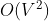
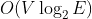

# 다익스트라 알고리즘
그래프에서 시작 정점부터 나머지 정점까지의 최단거리를 구하는 알고리즘.

**가중치에 음수가 있으면 안됨**

## 시간복잡도
정점의 개수가 V,
간선의 개수가 E일때

배열을 이용하는 경우  ,

우선순위 큐를 이용하는 경우  의 시간복잡도를 가진다.

## 배열 코드 
```c++
int Find_Shortest_Node()
{
    int Min_Dist, Min_Idx;
    Min_Dist = INF;
    Min_Idx = -1;
 
    for (int i = 1; i <= V; i++)
    {
        if (Select[i] == true) continue;
        if (Dist[i] < Min_Dist)
        {
            Min_Dist = Dist[i];
            Min_Idx = i;
        }
    }
    return Min_Idx;
}
 
void Update_Dist(int NewNode)
{
    for (int i = 1; i <= V; i++)
    {
        if (Select[i] == true) continue;
        if (Dist[i] > Dist[NewNode] + MAP[NewNode][i])
        {
            Dist[i] = Dist[NewNode] + MAP[NewNode][i];
        }
    }
}
 
void Dijkstra()
{
    for (int i = 1; i <= V; i++) Dist[i] = MAP[Start][i];
    Dist[Start] = 0;
    Select[Start] = true;
    
    for (int i = 0; i < V - 1; i++)
    {
        int NewNode = Find_Shortest_Node();
 
        Select[NewNode] = true;
        Update_Dist(NewNode);
    }
}
// 출처: https://yabmoons.tistory.com/364
```

## 우선순위 큐 코드 
```c++
void dijkstra(int s)
{
    priority_queue<pair<int, int>> pq;
    pq.push(make_pair(0, s));
    dist[s] = 0;
 
    while (pq.empty() == 0)
    {
        int cost = -pq.top().first;
        int curr = pq.top().second;
        pq.pop();

        if (cost > dist[curr]) continue;
        for (int i = 0; i < graph[curr].size(); i++)
        {
            int near = graph[curr][i].first;
            int nearcost = cost + graph[curr][i].second;
 
            if (nearcost > dist[near])
            {
                dist[near] = nearcost;
                pq.push(make_pair(-dist[near], near));
            }
        }
    }
}
```